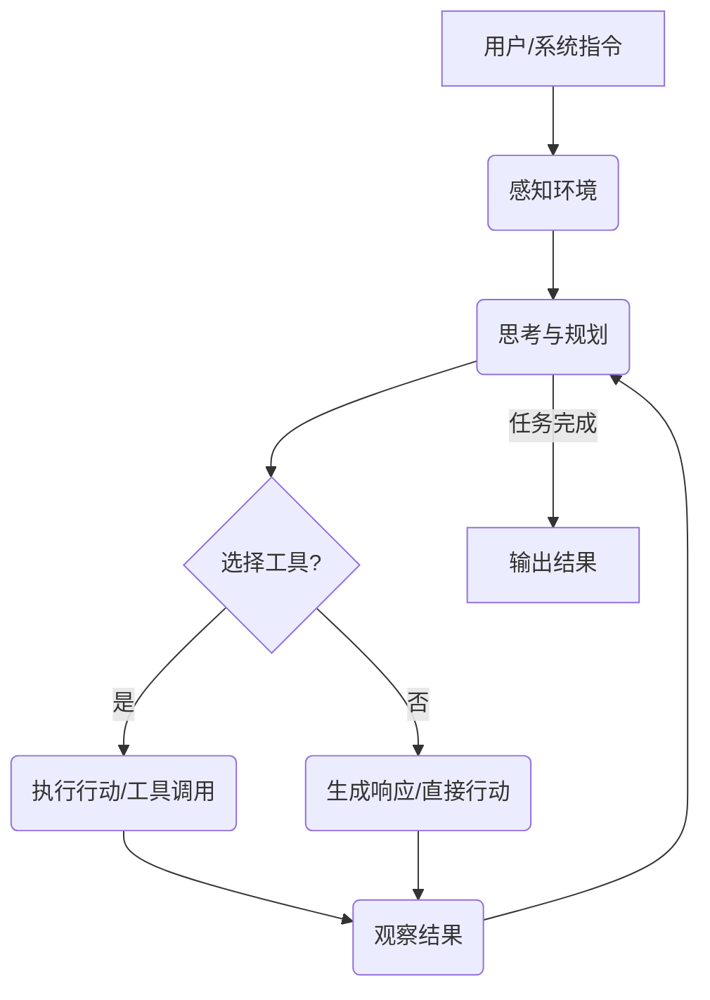

大模型智能体（Agent）是基于大型语言模型（LLM）构建的AI实体，具备感知、决策、规划和行动能力，能够自主与环境互动并完成任务。它通过感知模块获取信息，利用LLM进行推理规划，通过记忆模块存储经验，并借助工具使用模块调用外部工具执行行动。其核心工作流程是“感知-思考-行动”循环，使其从被动响应转变为主动解决复杂问题，是实现通用人工智能的关键一步。
<!-- more -->

## 1.1 什么是大模型智能体？

大模型智能体（Agent）是指基于大型语言模型（LLM）构建的，能够感知环境、自主决策、规划行动并执行任务的AI实体。与传统的LLM仅仅作为文本生成或理解工具不同，智能体被赋予了“思考”和“行动”的能力，使其能够更主动、更智能地与世界互动，解决复杂问题。

<!-- more -->

### 1.1.1 定义与特征

::: tip 核心定义
大模型智能体是基于LLM构建的AI实体，具备感知、决策、规划和行动能力，能够自主与环境互动并完成任务。
:::
<Badge text="核心" type="success"/>

*   **自主性 (Autonomy)**：
    *   **浅层理解**：智能体能自己做决定，不需要人一直盯着。
    *   **深入分析**：智能体能够独立地执行任务，无需人类的持续干预。它能够根据环境变化和任务目标，自主地制定计划、选择工具并执行行动，展现出一定程度的独立思考能力。
*   **感知能力 (Perception)**：
    *   **浅层理解**：能“看”到、“听”到环境中的信息。
    *   **深入分析**：能够从环境中获取信息，理解当前状态。这包括通过API调用获取数据、读取文档、解析网页内容、处理传感器数据或理解用户输入等。感知模块将这些非结构化数据转化为LLM可理解的格式。
*   **推理与规划 (Reasoning & Planning)**：
    *   **浅层理解**：能“思考”怎么做，并制定步骤。
    *   **深入分析**：利用LLM强大的推理能力，智能体能够分析任务、理解目标、分解复杂问题为子任务，并制定一系列行动计划。这可能涉及逻辑推理、因果关系判断和多步骤决策。
*   **行动能力 (Action)**：
    *   **浅层理解**：能“动手”操作，比如使用工具。
    *   **深入分析**：能够通过调用外部工具、API接口或直接与环境交互来执行规划好的行动。这是智能体与传统LLM最显著的区别之一，使其能够从“语言模型”转变为“行动实体”。
*   **记忆能力 (Memory)**：
    *   **浅层理解**：能记住过去发生的事情和学到的知识。
    *   **深入分析**：能够存储和检索智能体的历史交互、学习到的知识、经验和长期目标。记忆可以是短期（如LLM的上下文窗口）或长期（如向量数据库、知识图谱），以指导未来的决策和规划。
    *   **伪代码示例：Agent决策循环**
        ```pseudocode
        Function AgentDecisionLoop(Initial_Task, Environment, LLM, Tools, Memory):
            Current_Task = Initial_Task
            While Current_Task is not Completed:
                // 1. 感知环境
                Observation = Environment.Perceive()
                
                // 2. 思考与规划 (LLM作为大脑)
                Thought_Process = LLM.Reason(Current_Task, Observation, Memory.Retrieve_ShortTerm(), Memory.Retrieve_LongTerm())
                
                // 3. 提取行动计划
                Action_Plan = Extract_Action_Plan(Thought_Process) // 从LLM输出中解析行动
                
                // 4. 选择工具并执行
                If Action_Plan.Requires_Tool:
                    Tool_Name = Action_Plan.Tool_Name
                    Tool_Inputs = Action_Plan.Tool_Inputs
                    Tool_Result = Tools.Execute(Tool_Name, Tool_Inputs)
                    Environment.Update(Tool_Result) // 更新环境状态
                    Memory.Store_ShortTerm(Tool_Result) // 存储工具执行结果
                Else:
                    // 直接行动或生成响应
                    Response = LLM.Generate_Response(Thought_Process)
                    Environment.Update(Response)
                    Current_Task = Completed // 假设直接响应即完成任务
                
                // 5. 反思与学习 (可选)
                If Action_Plan.Requires_Reflection:
                    Reflection = LLM.Reflect(Thought_Process, Tool_Result, Current_Task)
                    Memory.Store_LongTerm(Reflection) // 更新长期记忆
                
                // 检查任务是否完成或达到终止条件
                If Check_Completion(Current_Task, Environment):
                    Break
            
            Return Environment.Final_State
        ```
        这个伪代码展示了Agent的核心决策循环，即“感知-思考-行动”的迭代过程。Agent利用LLM进行推理和规划，根据需要选择并调用外部工具，然后观察行动结果，并可能进行反思以优化未来的决策，直到任务完成。

## 1.2 智能体的核心组件

一个典型的大模型智能体通常包含以下核心组件，它们协同工作以实现智能体的自主行为。

### 1.2.1 感知模块 (Perception Module)

*   **功能**：从环境中获取信息，并将非结构化数据转化为LLM可理解的格式。
*   **输入源**：API调用（如天气API、股票API）、数据库查询、网页抓取（Web Scraping）、传感器数据、用户输入（文本、语音、图像）等。
*   **技术**：自然语言处理（NLP）用于理解文本，计算机视觉（CV）用于理解图像，语音识别（ASR）用于理解语音。

### 1.2.2 规划模块 (Planning Module)

*   **功能**：基于感知到的信息和预设目标，利用LLM的推理能力生成一系列行动步骤或子目标。
*   **关键技术**：
    *   **任务分解 (Task Decomposition)**：将复杂任务分解为更小的、可管理的子任务，例如“写一篇报告”可以分解为“收集数据”、“分析数据”、“撰写初稿”、“修改润色”。
    *   **工具选择 (Tool Selection)**：根据任务需求，智能体能够动态地选择和调用合适的外部工具。
    *   **逻辑推理 (Logical Reasoning)**：利用LLM的逻辑推理能力，制定合理的行动序列和决策路径。
    *   **思维链 (Chain-of-Thought, CoT)**：引导LLM逐步思考，将复杂问题分解为中间步骤，提高规划的准确性和可解释性。
    *   **树状搜索 (Tree Search)**：如ReAct、Tree of Thoughts等，探索不同的思维路径，进行回溯和剪枝，以找到最佳解决方案。

### 1.2.3 记忆模块 (Memory Module)

*   **功能**：存储智能体的历史交互、学习到的知识、经验和长期目标，以指导未来的决策。
*   **类型**：
    *   **短期记忆 (Short-term Memory)**：通常指LLM的上下文窗口，用于存储当前对话或任务的临时信息，如最近的几轮对话。
    *   **长期记忆 (Long-term Memory)**：存储持久化的知识和经验，通常通过向量数据库实现，支持高效检索。例如，智能体学习到的新技能、用户偏好、领域知识等。
*   **技术**：向量嵌入、向量数据库（Pinecone, Weaviate, Milvus, Chroma）、知识图谱等。

### 1.2.4 工具使用模块 (Tool Use Module)

*   **功能**：使智能体能够调用外部工具来扩展其能力，弥补LLM自身能力的不足（如实时信息获取、精确计算、与外部系统交互）。
*   **工具类型**：
    *   **搜索引擎**：获取实时信息（如Google Search、Bing Search）。
    *   **计算器**：执行精确的数学计算。
    *   **代码解释器**：执行代码、调试、数据分析、生成图表。
    *   **API接口**：与外部系统（如日历、邮件、CRM、项目管理工具）交互。
    *   **自定义工具**：根据特定任务需求开发的工具。
*   **重要性**：是智能体从“语言模型”到“行动实体”的关键桥梁，极大地扩展了智能体的能力边界。

### 1.2.5 行动模块 (Action Module)

*   **功能**：执行规划模块生成的行动，并通过工具使用模块与外部世界进行交互。
*   **实现**：将LLM生成的行动指令转化为可执行的操作，并监控执行结果。例如，如果LLM决定“搜索天气”，行动模块会调用搜索引擎工具并处理其返回结果。

## 1.3 智能体的工作流程

大模型智能体的工作流程通常是一个循环过程，被称为“感知-思考-行动”循环。
<Badge text="流程" type="tip"/>

::: details 智能体工作流程图解

:::

1.  **接收任务 (Task Reception)**：智能体接收到用户或系统分配的初始任务或目标。
2.  **感知环境 (Environment Perception)**：智能体通过感知模块从环境中获取当前状态、相关数据和反馈信息。这些信息被转化为LLM可理解的输入。
3.  **思考与规划 (Thought & Planning)**：LLM结合任务目标、感知信息和记忆（短期与长期），进行推理和规划。生成“思考”（Thought）过程，包括任务分解、子目标设定、工具选择等。制定下一步的“行动”（Action）计划。
4.  **选择工具 (Tool Selection)**：根据规划，智能体决定是否需要调用外部工具，并选择最合适的工具。这通常涉及LLM根据工具描述和当前任务上下文进行判断。
5.  **执行行动 (Action Execution)**：通过行动模块和工具使用模块执行选定的行动。行动可以是调用API、执行代码、发送消息、修改文件等。
6.  **观察结果 (Observation)**：感知模块观察行动的执行结果和环境的变化。结果（Observation）被反馈给智能体，作为下一轮循环的输入。
7.  **反思与学习 (Reflection & Learning)**：智能体根据行动结果进行反思，评估行动是否成功，是否需要调整计划。更新长期记忆，从经验中学习，优化未来的决策。
8.  **循环 (Loop)**：重复上述步骤，直到任务完成、达到终止条件或无法继续。

::: tip 总结
大模型智能体通过整合感知、规划、记忆、工具使用和行动等核心组件，实现了从被动响应到主动行动的转变。其“感知-思考-行动”循环是实现自主行为的基础，使其能够更智能地与世界互动并解决复杂问题。
:::
