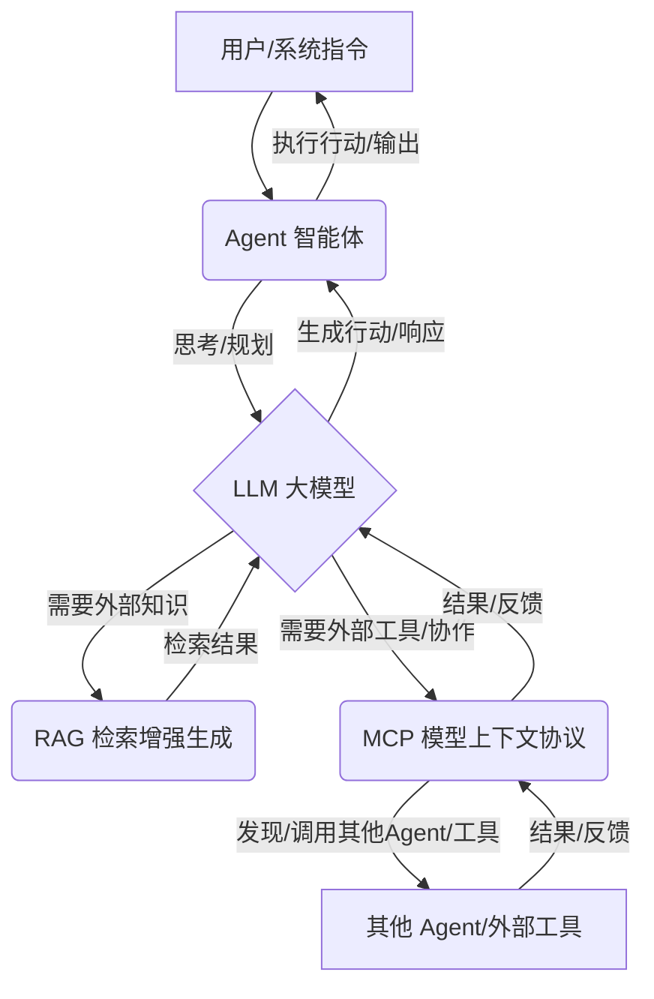

大模型生态中，RAG、MCP和Agent是构建智能AI系统的关键组件。RAG通过外部知识库解决大模型“幻觉”和知识时效性问题，确保信息准确性。MCP作为标准化协议，促进不同AI智能体间的通信与协作。Agent则将大模型的推理能力与外部工具结合，实现自主决策和复杂任务执行。三者相互补充，共同推动AI从单一模型向复杂协作系统演进，提升AI的可靠性和智能水平。
<!--more-->

## 5.1 RAG (Retrieval-Augmented Generation)：知识增强的基石

::: tip 浅层理解
RAG让大模型能“查资料”再回答问题，确保答案更准确、更新。
:::
<Badge text="知识增强" type="tip"/>

*   **核心作用**：RAG旨在解决大模型“幻觉”问题和知识时效性问题。它通过在生成答案前，从外部知识库中检索相关信息，并将这些信息作为上下文输入给LLM，从而使LLM能够基于事实依据生成更准确、更可靠的回答。
*   **与大模型的关系**：RAG是增强大模型知识获取能力的一种重要范式。它将大模型从其固有的训练数据限制中解放出来，使其能够访问和利用外部的、实时更新的知识。
*   **主要解决问题**：
    *   **知识更新**：LLM训练数据通常是静态的，RAG允许模型获取最新信息。
    *   **减少幻觉**：提供外部证据，降低模型生成不准确信息的风险。
    *   **可解释性**：可以追溯到信息来源。

## 5.2 MCP (Model Context Protocol)：智能体协作的桥梁

::: tip 浅层理解
MCP是智能体之间沟通的“语言和规则”，让它们能互相理解、协作。
:::
<Badge text="协作桥梁" type="warning"/>

*   **核心作用**：MCP是一种标准化协议，旨在促进不同LLM或AI智能体之间高效、标准化通信和协作。它定义了智能体之间如何共享上下文、描述能力、交换数据以及进行交互。
*   **与大模型的关系**：MCP为大模型（作为智能体的核心大脑）之间的协作提供了基础设施。它使得多个大模型或基于大模型的智能体能够作为一个整体，共同完成复杂任务。
*   **主要解决问题**：
    *   **互操作性**：解决不同智能体之间的数据格式和通信标准不统一的问题。
    *   **上下文管理**：确保智能体之间能够有效共享和理解彼此的上下文信息。
    *   **能力发现**：使智能体能够发现和调用其他智能体的功能。

## 5.3 Agent (大模型智能体)：自主行动的实体

::: tip 浅层理解
Agent是“有大脑（大模型）有手脚（工具）”的AI，能自主思考、规划并执行任务。
:::
<Badge text="自主行动" type="success"/>

*   **核心作用**：Agent是基于LLM构建的，能够感知环境、自主决策、规划行动并执行任务的AI实体。它将LLM的推理能力与外部工具结合，使其能够与真实世界互动。
*   **与大模型的关系**：大模型是Agent的“大脑”，提供强大的推理、理解和生成能力。Agent则将大模型的能力具象化，使其能够通过工具与环境进行交互，从被动响应变为主动行动。
*   **主要解决问题**：
    *   **自主决策**：使AI能够独立地制定和执行计划。
    *   **工具使用**：扩展LLM的能力边界，使其能够执行计算、搜索、API调用等操作。
    *   **复杂任务解决**：通过多步骤规划和执行，解决单一LLM难以完成的复杂问题。

## 5.4 RAG、MCP、Agent 之间的协同关系

RAG、MCP和Agent并非孤立存在，它们在大模型生态中相互补充，共同构建更强大、更智能的AI系统。

::: details 协同关系图解

:::

1.  **Agent 利用 RAG 获取知识**：
    *   当Agent在执行任务或进行规划时，如果发现自身知识不足或需要最新信息，它可以通过RAG模块从外部知识库中检索相关信息。
    *   RAG为Agent提供了“查阅资料”的能力，确保Agent的决策和生成内容基于准确、实时的信息。
2.  **Agent 利用 MCP 进行协作**：
    *   当一个Agent需要调用另一个Agent的功能，或者需要与其他AI服务进行交互时，它可以通过MCP来发现、连接和通信。
    *   MCP为Agent之间的“团队协作”提供了标准化的沟通渠道和规则，使得不同Agent能够无缝集成，共同完成复杂任务。
3.  **MCP 促进 RAG 知识库的共享与管理**：
    *   MCP可以定义知识库的接口和访问协议，使得RAG模块能够更方便地集成和管理多个知识源。
    *   通过MCP，不同的RAG系统或知识库可以相互发现和利用，形成一个更庞大的知识网络。
4.  **大模型是三者的核心驱动**：
    *   LLM是Agent的“大脑”，负责推理、规划和生成。
    *   LLM是RAG的“生成器”，负责根据检索到的信息生成答案。
    *   LLM的能力也决定了MCP中智能体之间上下文理解和交互的深度。

::: tip 总结
RAG、MCP和Agent共同构成了大模型应用生态的关键组成部分。RAG增强了大模型的知识获取能力，MCP解决了智能体之间的互操作性问题，而Agent则将大模型的能力具象化为自主行动的实体。三者协同工作，共同推动着人工智能从单一模型向复杂、智能、协作的AI系统演进。
:::
